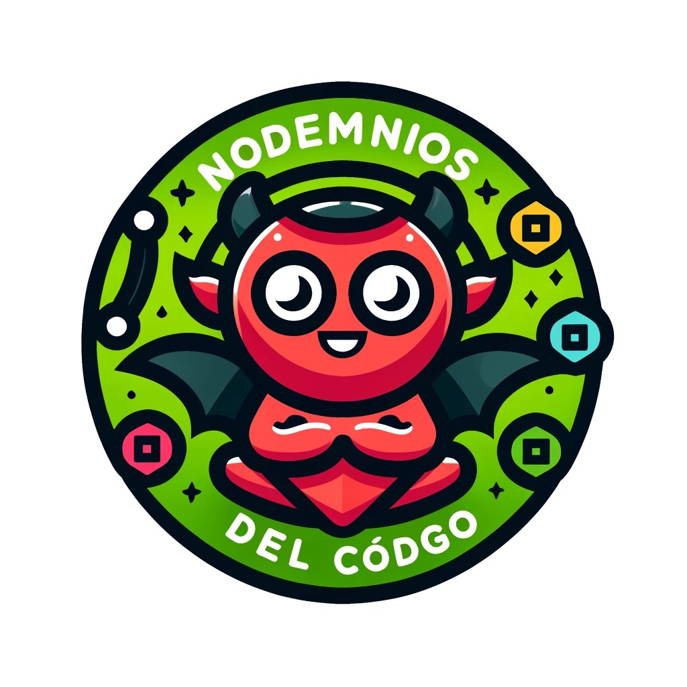
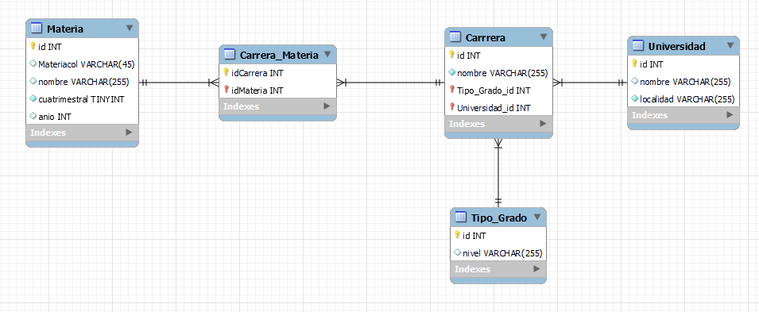

TP-Laboratorio de Programación y Lenguaje

## Grupo Integrado por: BUSTAMANTE, UCIEL - LAMAS, MARTÍN - PELOZO, KAREN M. - MONTENEGRO, CARLA V.

El presente proyecto consiste en una APIREST desarrollado en NODE.js, con distintas dependencias que permiten el manejo y consulta de la misma, a modo de CRUD.

## Guía de Uso.

A continuación, se detallan dos opciones para obtener el proyecto: clonarlo desde el repositorio o descargarlo como un archivo ZIP.

### Opción 1. Clonación del Repositorio.

a. Clonar el repositorio desde el botón <**Code**>, copiando la dirección URL del repositorio y seleccionando **HTTPS**.

b. Desde la terminal **Git Bash**, cambie al directorio en el que desea clonar el proyecto.

c. Escriba el comando `git clone` y, a continuación, pegue la URL, luego presione **Enter**.

### Opción 2. Descargar Repositorio.

a. Descargar el repositorio desde el botón <**Code**>, en la opción **Download ZIP**.

b. Descomprimir el archivo descargado en la dirección donde desea desplegar el proyecto.

## Guía de Arranque.

A continuación, se detallara una guía para iniciar el servidor.

### 1. Abrir el proyecto.

a. Debera abrir el proyecto con un editor de codigo, por ejemplo, VSCode.

b. Debera correr el siguiente comando en la terminal: **npm install**, para que se descarguen las dependencias necesarias para el proyecto.

c. Debera utilizar el comando **npm run dev** para que inicie el servidor.

Esta proyecto utiliza las siguiente estructura de  tablas: 

# Estructura del proyecto:  

- Una universidad puede tener muchas carreras. 

- Una carrera puede tener muchas materias.

- Una materia puede pertenecer a muchas carreras.

- Una carrera puede tener un tipo de grado.

- Un tipo de grado puede estar asociado a muchas carreras.

- Al borrar una materia se borrara su asociacion con carreras.

# Enpoints:

| Verbo | Recurso | Status Code | Descripción |
|-------|---------|-------------|-------------|
| GET   | /universidades          | 200 | Obtener todas las universidades |
| GET   | /universidades/:id      | 200, 404 | Obtener universidad por ID |
| POST  | /universidades          | 201, 400 | Crear una nueva universidad |
| DELETE| /universidades/:id      | 200, 404 | Eliminar universidad por ID |
| PUT   | /universidades/:id      | 200, 404, 400 | Actualizar universidad por ID |
| GET   | /carreras               | 200 | Obtener todas las carreras |
| GET   | /carreras/:id           | 200, 404 | Obtener carrera por ID |
| POST  | /carreras               | 201, 400 | Crear una nueva carrera |
| DELETE| /carreras/:id           | 200, 404 | Eliminar carrera por ID |
| PUT   | /carreras/:id           | 200,404, 400 | Actualizar carrera por ID |
| GET   | /tipo-grados             | 200 | Obtener todos los tipos de grado |
| GET   | /tipo-grados/:id         | 200, 404 | Obtener tipo de grado por ID |
| POST  | /tipo-grados             | 201, 400 | Crear un nuevo tipo de grado |
| PUT   | /tipo-grados/:id         | 200, 404, 400 | Actualizar tipo de grado por ID |
| GET   | /materias               | 200 | Obtener todas las materias |
| GET   | /materias/:id           | 200, 404 | Obtener materia por ID |
| POST  | /materias               | 201, 400 | Crear una nueva materia |
| DELETE| /materias/:id           | 200, 404 | Eliminar materia por ID |
| PUT   | /materias/:id           | 200, 404, 400 | Actualizar materia por ID |
| GET   | /carrera-materias        | 200 | Obtener materias asociadas a carrera |
| POST  | /carrera-materias        | 201, 404 | Crear asociación entre carrera y materia |  

4. Este proyecto utiliza un motor de base de datos SQLIte3 y la base será inicializado cuando ejecute el comando npm run dev.

## Guía para Importar el Archivo Postman y Probar la API

A continuación, se detalla una guía para importar el archivo Postman con todas las solicitudes necesarias para probar la API de este proyecto.

### 1. Descargar el Archivo Postman

Utilice el archivo Postman que se encuentra en el repositorio (`TP-TALLER.postman_collection.json`).

### 2. Abrir Postman

Abra Postman en su computadora. Si no tiene Postman instalado, puede descargarlo desde [https://www.postman.com/downloads/](https://www.postman.com/downloads/).

### 3. Importar el Archivo Postman

Siga estos pasos para importar el archivo Postman:

a. En la esquina superior izquierda de Postman, haga clic en el botón **Import**.

b. En la ventana de importación, seleccione la pestaña **Upload Files**.

c. Arrastre y suelte el archivo (`TP-TALLER.postman_collection.json` que se encuentra en la raiz del proyecto) en el área designada o haga clic en **Choose Files** y seleccione el archivo desde su sistema de archivos.

d. Haga clic en **Import** para importar el archivo.

### 4. Verificar las Colecciones Importadas

Una vez que el archivo se haya importado, debería ver una nueva colección en la barra lateral izquierda de Postman con el nombre de la colección que fue exportada. Esta colección contiene todas las solicitudes necesarias para probar la API del proyecto.

